<p align="center">
  
</p>

# CampusClub🎯

## Basic Details

### Team Name: NS Chaos

### Team Members
- Member 1: Nathasha Vipin - College of Engineering Thalassery
- Member 2: Sreelakshmi T M - College of Engineering Thalassery

### Hosted Project Link
[mention your project hosted link here]

### Project Description
A full-stack web application that enables clubs, coordinators, and students to manage club activities and events on campus. Admins can create and oversee clubs, coordinators organize events (which require admin approval), and students can browse approved events and register with instant confirmation.

### The Problem statement
Current Challenge:
Campus club management is fragmented and inefficient. Admins manually manage club creation without centralized oversight, coordinators struggle to organize events with no formal approval workflow, and students lack a unified platform to discover clubs and register for events. This leads to confusion, duplicated efforts, and lost opportunities for student engagement.

Key Issues:

1.No centralized club management - Clubs are created and managed through various channels with no standardized process
2.Lack of event approval workflow - Events can be created without admin review, leading to scheduling conflicts and oversight gaps
3.Manual registration process - Students must navigate multiple channels to find and register for events, causing low participation
4.Limited visibility - Admins have no real-time insights into club activities, events, and student engagement metrics
5.Poor coordination between roles - Admin, coordinator, and student workflows are disconnected, creating bottlenecks

### The Solution
CampusClub provides a unified platform where admins create and oversee clubs, coordinators organize events requiring admin approval before visibility, and students easily discover approved events and auto-register. This streamlines campus club operations, ensures proper oversight, and increases student engagement.

---

## Technical Details

### Technologies/Components Used

**For Software:**
- Languages used: JavaScript, HTML, CSS
- Frameworks used: React, Express.js
- Libraries used: Mongoose, Axios, Tailwind CSS, React Router, jsonwebtoken, bcryptjs, React Hot Toast, Recharts, CORS, dotenv
- Tools used: VS Code, Git, npm, nodemon, MongoDB Atlas, Postman

**For Hardware:**
- Main components: [List main components]
- Specifications: [Technical specifications]
- Tools required: [List tools needed]

---

## Features

- **Club Management**: Admins can create, edit, and delete clubs with assigned faculty coordinators
- **Event Approval Workflow**: Coordinators create events which require admin approval before becoming visible to students
- **Student Registration**: Students can browse approved events and register with instant confirmation (auto-approval)
- **Role-Based Dashboards**: Distinct dashboards for Admin, Faculty Coordinator, and Student roles with appropriate permissions
- **Real-Time Status Tracking**: Students receive immediate registration confirmations; Admins have real-time visibility into club activities and event metrics

---

## Implementation

### For Software:

#### Prerequisites
- **Node.js** (v18 or higher) - [Download](https://nodejs.org/)
- **npm** (v9 or higher) - Comes with Node.js
- **MongoDB Atlas Account** - [Sign up](https://www.mongodb.com/cloud/atlas)
- **Git** - [Download](https://git-scm.com/)

#### Installation

**Step 1: Clone the Repository**
```bash
git clone <repository-url>
cd smart-campus/CampusClub
```

**Step 2: Backend Setup**
```bash
cd server
npm install
```

Create a `.env` file in the `server` directory with the following variables:
```
MONGODB_URI=your_mongodb_atlas_connection_string
JWT_SECRET=your_jwt_secret_key
PORT=5000
```

**Step 3: Frontend Setup**
```bash
cd ../client
npm install
```

#### Run

**Option 1: Using npm (Separate Terminals)**

Terminal 1 - Start Backend:
```bash
cd server
npm start
```

Terminal 2 - Start Frontend:
```bash
cd client
npm run dev
```

The application will be available at:
- **Frontend**: http://localhost:5173
- **Backend API**: http://localhost:5000

**Option 2: Using PowerShell Script (Windows)**
```powershell
.\start.ps1
```
This script automatically starts both servers and sets up test users.

**Option 3: Using Shell Script (Mac/Linux)**
```bash
bash start.sh
```

#### Test Users
After running the application, you can log in with these credentials:
- **Admin**: admin@test.com / password123
- **Coordinator**: coordinator@test.com / password123
- **Student**: student@test.com / password123

### For Hardware:

#### Components Required
[List all components needed with specifications]

#### Circuit Setup
[Explain how to set up the circuit]

---

## Project Documentation

### For Software:

#### Screenshots

**Home Page**
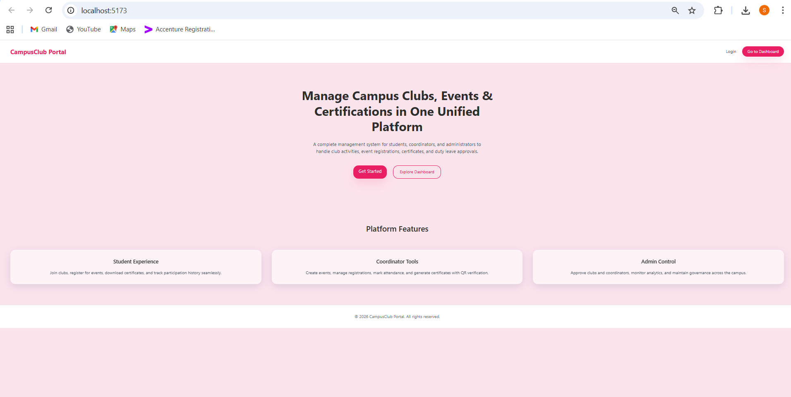

**Admin Dashboard**
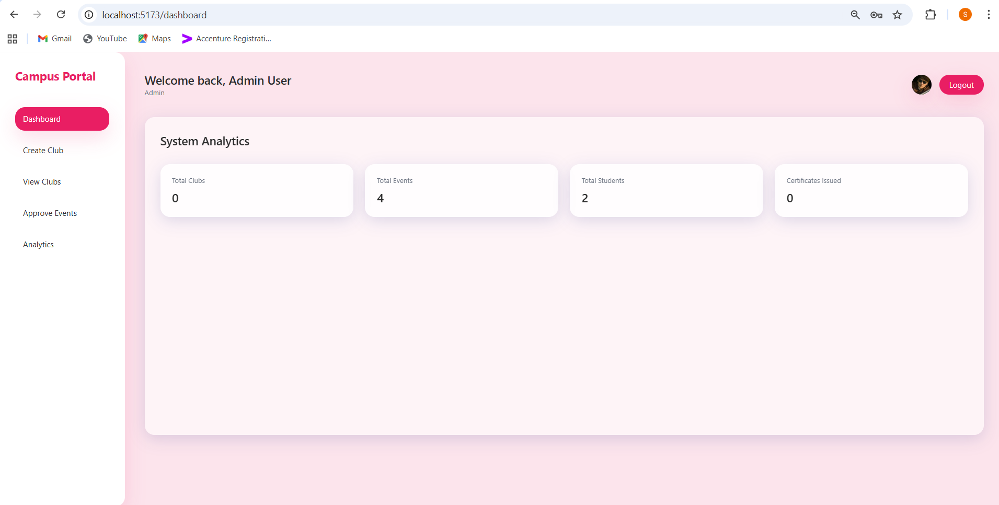
*Admin dashboard showing overview of clubs, events, and system statistics. Displays real-time metrics for campus club activities and pending approvals.*

**Admin Create Club**
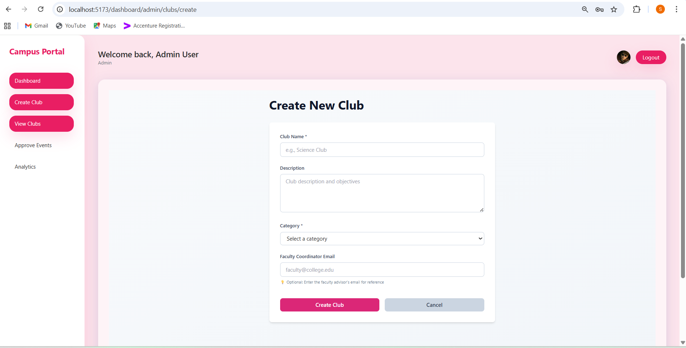
*Admin interface for creating new clubs with name, description, and faculty coordinator assignment.*

**Admin Approve Events**
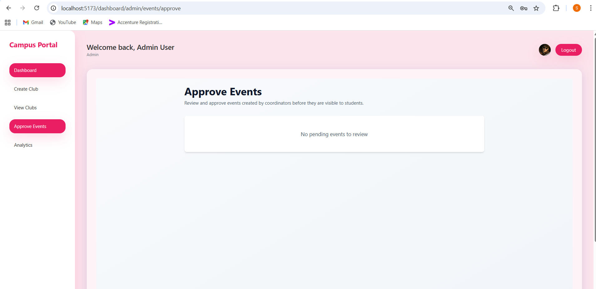
*Admin panel for reviewing and approving/rejecting events created by coordinators before they become visible to students.*

**Admin View Clubs**
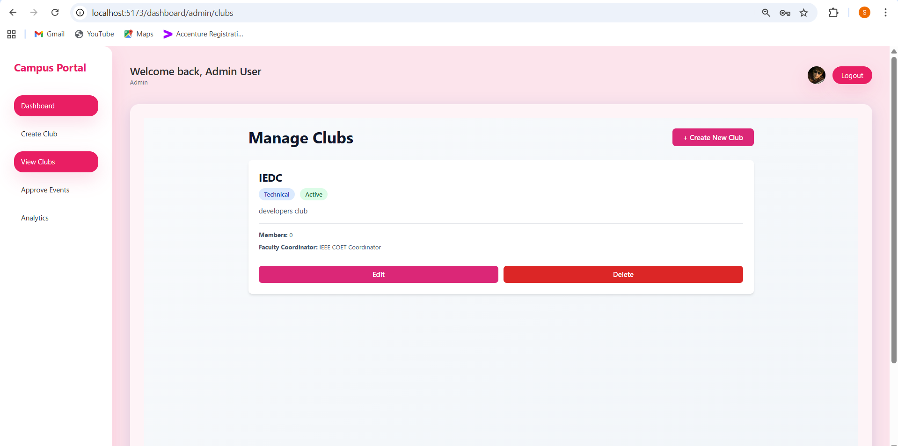
*List view of all clubs with management options, showing club details, coordinator assignments, and member count.*

**Admin Analytics**
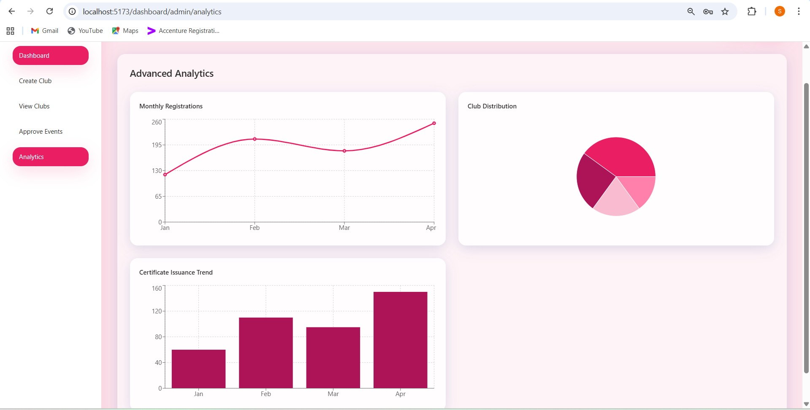
*Analytics dashboard displaying charts and statistics on club activities, event participation, and student engagement metrics.*

**Coordinator Dashboard**
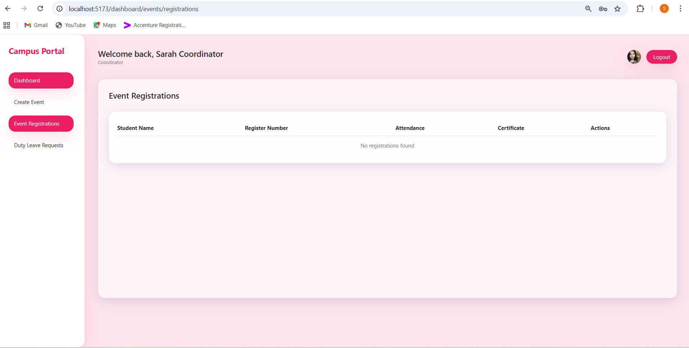
*Coordinator dashboard showing assigned club, events created, and pending approvals awaiting admin review.*

**Coordinator Create Event**
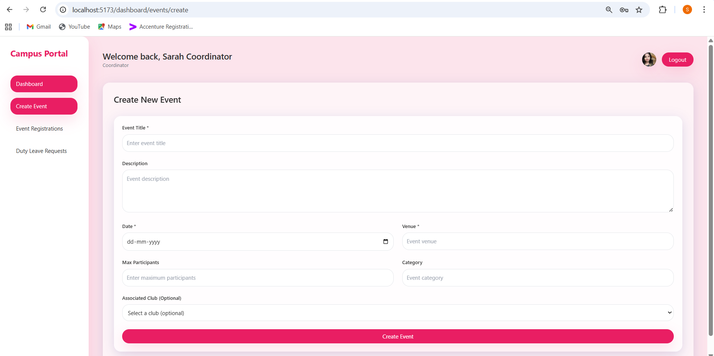
*Event creation form for coordinators to submit new events with details, date/time, location, and capacity information.*

**Coordinator Event Registration**

*Coordinator view of student registrations for events with approval/rejection options and attendance tracking.*

**Student Dashboard**
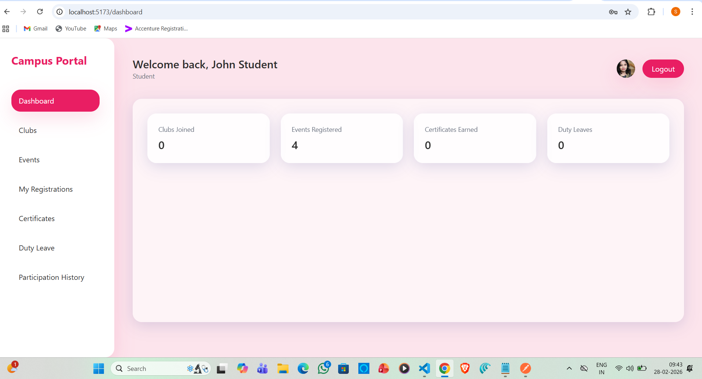
*Student dashboard providing quick access to clubs, approved events, and personal registration history.*

**Student Event Registration**
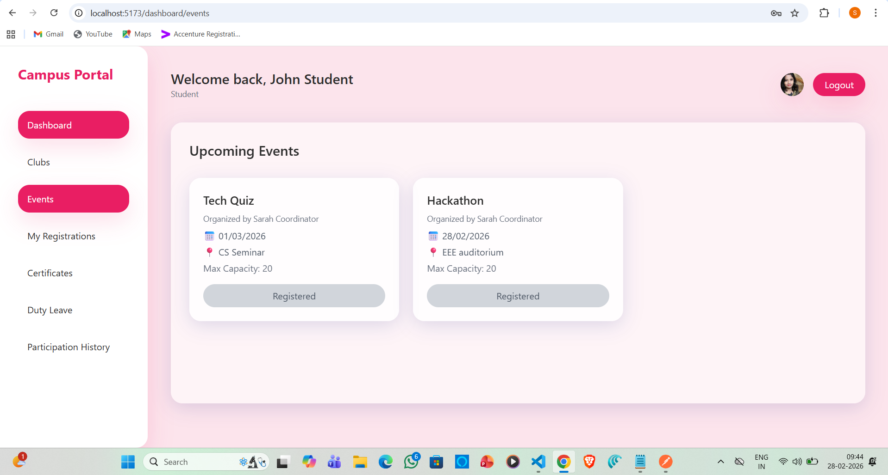
*Student interface for browsing available events and registering with one-click registration and auto-confirmation.*

**Student Registrations**
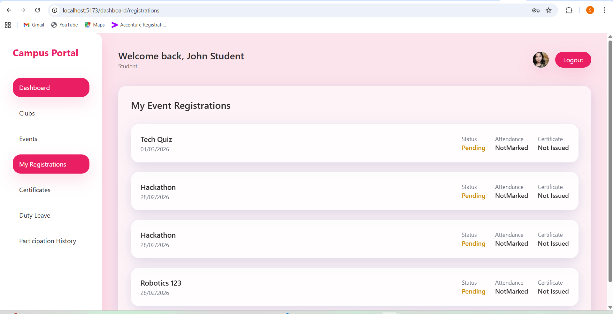
*Student view of all event registrations with status, event details, and participation history.*

#### Diagrams

**System Architecture:**
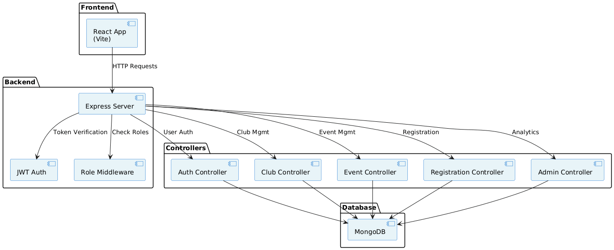
*System architecture showing the layered design with React frontend, Express backend, JWT authentication, role-based middleware, multiple controllers, and MongoDB database interaction flow.*

**Application Workflow:**
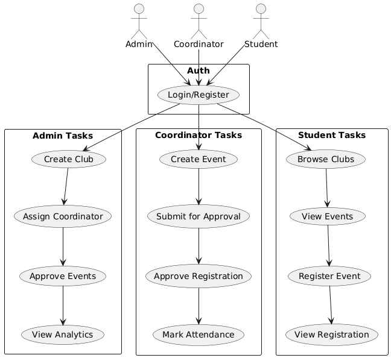
*Application workflow diagram illustrating the complete user journey for Admin, Coordinator, and Student roles with their respective tasks and interactions within the system.*

---

### For Hardware:

#### Schematic & Circuit


*Add caption explaining connections*


*Add caption explaining the schematic*

#### Build Photos


*List out all components shown*


*Explain the build steps*


*Explain the final build*

---

## Additional Documentation

### For Web Projects with Backend:

#### API Documentation

**Base URL:** `http://localhost:5000/api`

**Authentication:** All endpoints (except register and login) require a JWT token in the Authorization header:
```
Authorization: Bearer <token>
```

##### Authentication Endpoints

**POST /auth/register**
- **Description:** Register a new user account
- **Access:** Public
- **Request Body:**
```json
{
  "name": "John Doe",
  "email": "john@example.com",
  "password": "password123",
  "role": "Student"
}
```
- **Response:**
```json
{
  "status": "success",
  "message": "User registered successfully",
  "user": {
    "_id": "user_id",
    "name": "John Doe",
    "email": "john@example.com",
    "role": "Student"
  },
  "token": "jwt_token"
}
```

**POST /auth/login**
- **Description:** Login user and get authentication token
- **Access:** Public
- **Request Body:**
```json
{
  "email": "john@example.com",
  "password": "password123"
}
```
- **Response:**
```json
{
  "status": "success",
  "message": "Login successful",
  "user": {
    "_id": "user_id",
    "name": "John Doe",
    "email": "john@example.com",
    "role": "Student"
  },
  "token": "jwt_token"
}
```

##### Club Endpoints

**POST /clubs**
- **Description:** Create a new club (Admin only)
- **Access:** Admin
- **Request Body:**
```json
{
  "name": "Tech Club",
  "description": "Club for tech enthusiasts",
  "coordinator": "coordinator_id"
}
```
- **Response:**
```json
{
  "status": "success",
  "message": "Club created successfully",
  "club": {
    "_id": "club_id",
    "name": "Tech Club",
    "description": "Club for tech enthusiasts",
    "coordinator": "coordinator_id",
    "members": []
  }
}
```

**GET /clubs**
- **Description:** Get all clubs (authenticated users)
- **Access:** All authenticated users
- **Response:**
```json
{
  "status": "success",
  "clubs": [
    {
      "_id": "club_id",
      "name": "Tech Club",
      "description": "Club for tech enthusiasts",
      "coordinator": "coordinator_id",
      "members": 15
    }
  ]
}
```

**GET /clubs/:id**
- **Description:** Get club details by ID
- **Access:** All authenticated users
- **URL Parameters:**
  - `id` (string): Club ID
- **Response:**
```json
{
  "status": "success",
  "club": {
    "_id": "club_id",
    "name": "Tech Club",
    "description": "Club for tech enthusiasts",
    "coordinator": "coordinator_id",
    "members": ["member1_id", "member2_id"]
  }
}
```

**PUT /clubs/:id**
- **Description:** Update club details (Admin only)
- **Access:** Admin
- **URL Parameters:**
  - `id` (string): Club ID
- **Request Body:**
```json
{
  "name": "Tech Club Updated",
  "description": "Updated description",
  "coordinator": "new_coordinator_id"
}
```
- **Response:**
```json
{
  "status": "success",
  "message": "Club updated successfully",
  "club": {}
}
```

**DELETE /clubs/:id**
- **Description:** Delete a club (Admin only)
- **Access:** Admin
- **URL Parameters:**
  - `id` (string): Club ID
- **Response:**
```json
{
  "status": "success",
  "message": "Club deleted successfully"
}
```

##### Event Endpoints

**POST /events**
- **Description:** Create a new event (Coordinator only - creates in Pending status)
- **Access:** Coordinator
- **Request Body:**
```json
{
  "title": "Tech Seminar",
  "description": "A seminar on latest technologies",
  "date": "2024-03-15",
  "time": "14:00",
  "location": "Auditorium",
  "club": "club_id",
  "capacity": 100
}
```
- **Response:**
```json
{
  "status": "success",
  "message": "Event created successfully",
  "event": {
    "_id": "event_id",
    "title": "Tech Seminar",
    "status": "Pending",
    "createdBy": "coordinator_id"
  }
}
```

**GET /events**
- **Description:** Get all events (Approved events for students, all for admin with ?all=true)
- **Access:** All authenticated users
- **Query Parameters:**
  - `all` (boolean): Get all events including pending (Admin only)
- **Response:**
```json
{
  "status": "success",
  "events": [
    {
      "_id": "event_id",
      "title": "Tech Seminar",
      "description": "A seminar on latest technologies",
      "date": "2024-03-15",
      "time": "14:00",
      "location": "Auditorium",
      "status": "Approved",
      "capacity": 100,
      "registrations": 45
    }
  ]
}
```

**GET /events/pending**
- **Description:** Get all pending events awaiting admin approval
- **Access:** Admin
- **Response:**
```json
{
  "status": "success",
  "events": [
    {
      "_id": "event_id",
      "title": "Tech Seminar",
      "status": "Pending",
      "createdBy": "coordinator_id"
    }
  ]
}
```

**PUT /events/:id/approve**
- **Description:** Approve an event (Admin only - changes status to Approved)
- **Access:** Admin
- **URL Parameters:**
  - `id` (string): Event ID
- **Response:**
```json
{
  "status": "success",
  "message": "Event approved successfully",
  "event": {
    "_id": "event_id",
    "status": "Approved"
  }
}
```

**PUT /events/:id/reject**
- **Description:** Reject an event (Admin only - changes status to Rejected)
- **Access:** Admin
- **URL Parameters:**
  - `id` (string): Event ID
- **Response:**
```json
{
  "status": "success",
  "message": "Event rejected successfully",
  "event": {
    "_id": "event_id",
    "status": "Rejected"
  }
}
```

##### Registration Endpoints

**POST /registrations**
- **Description:** Register for an event (Student only - auto-approves)
- **Access:** Student
- **Request Body:**
```json
{
  "event": "event_id"
}
```
- **Response:**
```json
{
  "status": "success",
  "message": "Registration successful",
  "registration": {
    "_id": "registration_id",
    "student": "student_id",
    "event": "event_id",
    "status": "Approved"
  }
}
```

**GET /registrations/my**
- **Description:** Get my event registrations (Student)
- **Access:** Student
- **Response:**
```json
{
  "status": "success",
  "registrations": [
    {
      "_id": "registration_id",
      "event": "event_id",
      "eventTitle": "Tech Seminar",
      "status": "Approved",
      "registeredAt": "2024-03-01"
    }
  ]
}
```

**PUT /registrations/:id/approve**
- **Description:** Approve event registration (Coordinator only)
- **Access:** Coordinator
- **URL Parameters:**
  - `id` (string): Registration ID
- **Response:**
```json
{
  "status": "success",
  "message": "Registration approved successfully",
  "registration": {
    "_id": "registration_id",
    "status": "Approved"
  }
}
```

**PUT /registrations/:id/reject**
- **Description:** Reject event registration (Coordinator only)
- **Access:** Coordinator
- **URL Parameters:**
  - `id` (string): Registration ID
- **Response:**
```json
{
  "status": "success",
  "message": "Registration rejected successfully",
  "registration": {
    "_id": "registration_id",
    "status": "Rejected"
  }
}
```

**GET /registrations/event/:id**
- **Description:** Get all registrations for an event (Coordinator/Admin)
- **Access:** Coordinator, Admin
- **URL Parameters:**
  - `id` (string): Event ID
- **Response:**
```json
{
  "status": "success",
  "registrations": [
    {
      "_id": "registration_id",
      "student": "student_id",
      "studentName": "John Doe",
      "status": "Approved",
      "registeredAt": "2024-03-01"
    }
  ]
}
```

**PUT /registrations/:id/attendance**
- **Description:** Mark attendance for a registration (Coordinator)
- **Access:** Coordinator
- **URL Parameters:**
  - `id` (string): Registration ID
- **Request Body:**
```json
{
  "attended": true
}
```
- **Response:**
```json
{
  "status": "success",
  "message": "Attendance marked successfully"
}
```

##### Admin Endpoints

**GET /admin/dashboard**
- **Description:** Get dashboard statistics (Admin only)
- **Access:** Admin
- **Response:**
```json
{
  "status": "success",
  "stats": {
    "totalClubs": 10,
    "totalEvents": 25,
    "totalStudents": 150,
    "pendingEventApprovals": 3,
    "upcomingEvents": 8
  }
}
```

##### Error Response Format

All errors follow this format:
```json
{
  "status": "error",
  "message": "Error description",
  "error": "Detailed error information"
}
```

**Common Status Codes:**
- `200`: Success
- `201`: Created
- `400`: Bad Request
- `401`: Unauthorized (Invalid/Missing token)
- `403`: Forbidden (Insufficient permissions)
- `404`: Not Found
- `500`: Internal Server Error

---

### For Mobile Apps:

#### App Flow Diagram


*Explain the user flow through your application*

#### Installation Guide

**For Android (APK):**
1. Download the APK from [Release Link]
2. Enable "Install from Unknown Sources" in your device settings:
   - Go to Settings > Security
   - Enable "Unknown Sources"
3. Open the downloaded APK file
4. Follow the installation prompts
5. Open the app and enjoy!

**For iOS (IPA) - TestFlight:**
1. Download TestFlight from the App Store
2. Open this TestFlight link: [Your TestFlight Link]
3. Click "Install" or "Accept"
4. Wait for the app to install
5. Open the app from your home screen

**Building from Source:**
```bash
# For Android
flutter build apk
# or
./gradlew assembleDebug

# For iOS
flutter build ios
# or
xcodebuild -workspace App.xcworkspace -scheme App -configuration Debug
```

---

### For Hardware Projects:

#### Bill of Materials (BOM)

| Component | Quantity | Specifications | Price | Link/Source |
|-----------|----------|----------------|-------|-------------|
| Arduino Uno | 1 | ATmega328P, 16MHz | ₹450 | [Link] |
| LED | 5 | Red, 5mm, 20mA | ₹5 each | [Link] |
| Resistor | 5 | 220Ω, 1/4W | ₹1 each | [Link] |
| Breadboard | 1 | 830 points | ₹100 | [Link] |
| Jumper Wires | 20 | Male-to-Male | ₹50 | [Link] |
| [Add more...] | | | | |

**Total Estimated Cost:** ₹[Amount]

#### Assembly Instructions

**Step 1: Prepare Components**
1. Gather all components listed in the BOM
2. Check component specifications
3. Prepare your workspace

*Caption: All components laid out*

**Step 2: Build the Power Supply**
1. Connect the power rails on the breadboard
2. Connect Arduino 5V to breadboard positive rail
3. Connect Arduino GND to breadboard negative rail

*Caption: Power connections completed*

**Step 3: Add Components**
1. Place LEDs on breadboard
2. Connect resistors in series with LEDs
3. Connect LED cathodes to GND
4. Connect LED anodes to Arduino digital pins (2-6)

*Caption: LED circuit assembled*

**Step 4: [Continue for all steps...]**

**Final Assembly:**

*Caption: Completed project ready for testing*

---

### For Scripts/CLI Tools:

#### Command Reference

**Basic Usage:**
```bash
python script.py [options] [arguments]
```

**Available Commands:**
- `command1 [args]` - Description of what command1 does
- `command2 [args]` - Description of what command2 does
- `command3 [args]` - Description of what command3 does

**Options:**
- `-h, --help` - Show help message and exit
- `-v, --verbose` - Enable verbose output
- `-o, --output FILE` - Specify output file path
- `-c, --config FILE` - Specify configuration file
- `--version` - Show version information

**Examples:**

```bash
# Example 1: Basic usage
python script.py input.txt

# Example 2: With verbose output
python script.py -v input.txt

# Example 3: Specify output file
python script.py -o output.txt input.txt

# Example 4: Using configuration
python script.py -c config.json --verbose input.txt
```

#### Demo Output

**Example 1: Basic Processing**

**Input:**
```
This is a sample input file
with multiple lines of text
for demonstration purposes
```

**Command:**
```bash
python script.py sample.txt
```

**Output:**
```
Processing: sample.txt
Lines processed: 3
Characters counted: 86
Status: Success
Output saved to: output.txt
```

**Example 2: Advanced Usage**

**Input:**
```json
{
  "name": "test",
  "value": 123
}
```

**Command:**
```bash
python script.py -v --format json data.json
```

**Output:**
```
[VERBOSE] Loading configuration...
[VERBOSE] Parsing JSON input...
[VERBOSE] Processing data...
{
  "status": "success",
  "processed": true,
  "result": {
    "name": "test",
    "value": 123,
    "timestamp": "2024-02-07T10:30:00"
  }
}
[VERBOSE] Operation completed in 0.23s
```

---

## Project Demo

### Video
[Add your demo video link here - YouTube, Google Drive, etc.]

*Explain what the video demonstrates - key features, user flow, technical highlights*

### Additional Demos
[Add any extra demo materials/links - Live site, APK download, online demo, etc.]

---

## AI Tools Used (Optional - For Transparency Bonus)

If you used AI tools during development, document them here for transparency:

**Tool Used:** [e.g., GitHub Copilot, v0.dev, Cursor, ChatGPT, Claude]

**Purpose:** [What you used it for]
- Example: "Generated boilerplate React components"
- Example: "Debugging assistance for async functions"
- Example: "Code review and optimization suggestions"

**Key Prompts Used:**
- "Create a REST API endpoint for user authentication"
- "Debug this async function that's causing race conditions"
- "Optimize this database query for better performance"

**Percentage of AI-generated code:** [Approximately X%]

**Human Contributions:**
- Architecture design and planning
- Custom business logic implementation
- Integration and testing
- UI/UX design decisions

*Note: Proper documentation of AI usage demonstrates transparency and earns bonus points in evaluation!*

---

## Team Contributions

- [Name 1]: [Specific contributions - e.g., Frontend development, API integration, etc.]
- [Name 2]: [Specific contributions - e.g., Backend development, Database design, etc.]
- [Name 3]: [Specific contributions - e.g., UI/UX design, Testing, Documentation, etc.]

---

## License

This project is licensed under the [LICENSE_NAME] License - see the [LICENSE](LICENSE) file for details.

**Common License Options:**
- MIT License (Permissive, widely used)
- Apache 2.0 (Permissive with patent grant)
- GPL v3 (Copyleft, requires derivative works to be open source)

---

Made with ❤️ at TinkerHub
